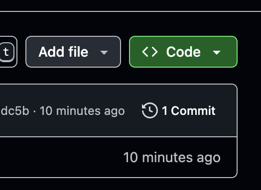
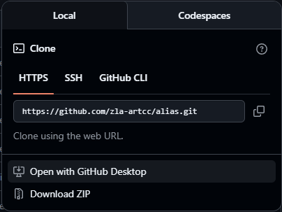

# ZLA Alias File

ZLA alias file versions and generation templates.

## Rationale

With new scripting tools, originally planned with the `dlrey` program, now succeeded by FE-Buddy 3.0, each individual section of the alias file is broken out into individual text files for ease of editing. 

The `main` branch should be left alone as the source of truth for the alias file that is live on the data admin. The `next` branch should be the main working branch. On release day those branches should match.

## Repository contents

```
.
├── alias-airplane-data  # Airplane information alias codes
├── alias-isr            # ISR files from FE-Buddy
├── alias-tec-routes     # TEC route information
├── output               # [Optional] default directory for newly-created alias files
├── alias.txt            # ZLA alias template file
├── approach+enroute.txt # Approach and enroute alias commands for text pilots
├── cwt.txt              # Consolidated wake turbulence information
├── delivery.txt		 # Clearance delivery aliases for text pilots
├── dva.txt				 # Diverse Vector Area helpers
├── general.txt			 # General alias commands
├── ground+local.txt	 # Ground and local control alias commands for text pilots
├── helpter.txt			 # The phraseology helper commands
├── history.txt          # ZLA alias file changelog
├── hours.txt			 # Tower hours of operation (included  in FEB .apt ISR, unique commands here for just tower hours)
├── laprefroutes.txt	 # Unused; future home of common preferred routes helper
├── notes.txt			 # File for alias commands that output as "Notes" in CRC
├── overrides.txt		 # Duplicate command overrides file
├── radar.txt 			 # Radar service commands for text pilots
├── utility.txt			 # Pilot/Controller utility alias commands
```

## How to generate a new alias file

### Making changes

Adjust your FE Buddy v3 settings, or import the settings included in the directory ensuring you adjust for your local file system. The FE Buddy settings link directly to the `next` branch.
Create a new branch from `next` and made your adjustments as required. 
Open a pull request to merge your working branch into `next` when ready, merging after FE review.

### Updating for the next AIRAC cycle

Use FE-Buddy v3, with its settings pointing at `next` or a local copy of the latest branch, to generate the combined alias file.
Merge `next` into `main`.

### Creating a release

Merge `next` into `main`, then use the latest "Combined_Alias.txt" file from FE-Buddy as the release asset.

### Automation

TODO: Automate release cutting using workflows

## Prior releases

All prior releases of the alias file created using this repository can be found on the [Releases page](https://github.com/ZLA-ARTCC/alias/releases).

## Legacy dlrey Instructions

If you need to run [dlrey](https://github.com/zla-artcc/dlrey) locally, you'll need to use Git to clone this repo.

If you're unfamiliar with Git, you may consider downloading [GitHub Desktop](https://desktop.github.com/download/). Then follow these steps.

1. Click the green `Code` button at the top-right of this page.<br />
1. Under the `Local` tab, click `Open with GitHub Desktop`.<br />
1. Follow the in-app prompts. If you're having trouble, please don't hesitate to DM @brianknight10 or @wsabransky for help.


